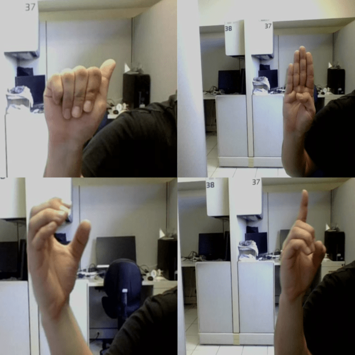
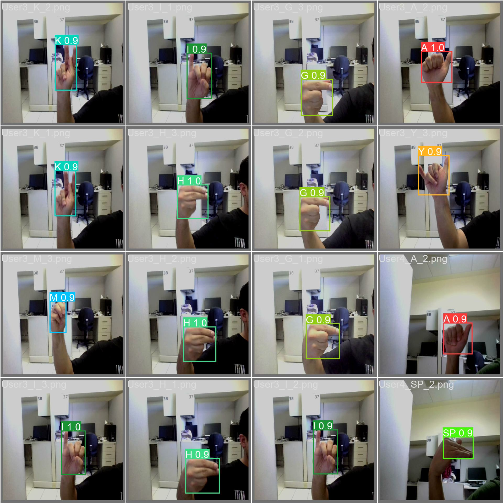
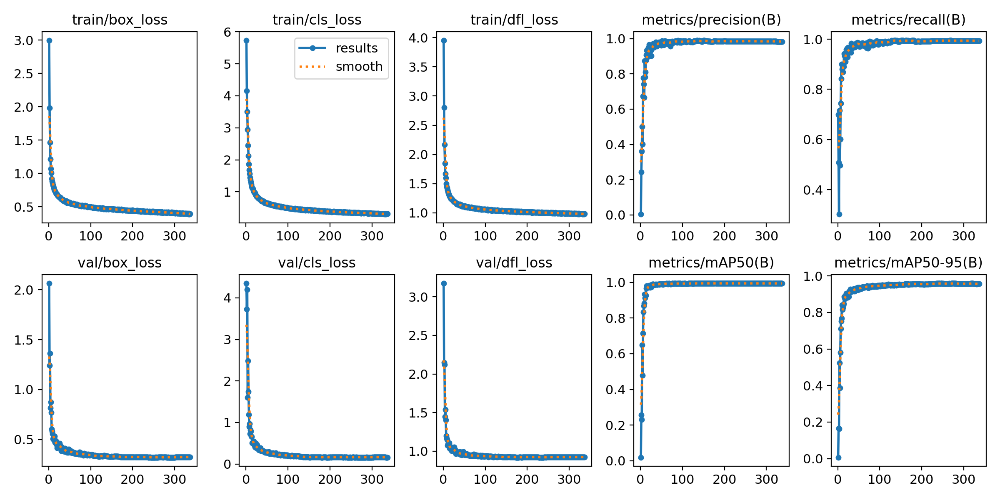

# **Sign Language Interpreter - Gesture Guide**

## **Overview**
The **Sign Language Interpreter** is a machine learning model designed as part of the Gesture Guide project, a virtual assistant for the hearing-impaired. It recognizes static sign language characters trained from images in real-time using a webcam. This model aims to bridge communication gaps for the hearing-impaired by converting sign language into text.

<video src="images/demo sign.mp4" title="Title"></video>

## **Features**
- **Real-time sign language character recognition** using a webcam feed.
- Recognizes **26 static characters** from the English alphabet.
- Supports **confidence-based predictions**, with characters displayed only when prediction confidence exceeds 90% users are also allowed to play with confidence levels.
- Integrated into both **desktop and mobile applications**, allowing users to string together characters to form messages as a part of the Gesture Guide project, this streamlit application features only the sign language model.

## **Model Details**
- **Model**: YOLO (You Only Look Once) Convolutional Neural Network.
- **Dataset**: 5,200 labeled images (416x416 resolution) of static sign language characters.
- **Classes**: 26 (English alphabet).

\


Figure 1: Overview of the images from the Dataset
  
## **Training Setup**
- **Epochs**: 300
- **Batch Size**: 64
- **Optimizer**: Adam
- **Precision/Recall/MAP-50**: ~0.99 on the validation set.



Figure 2: Model Predictions on Validation Set

  
## **Installation**
To set up and run the Sign Language Interpreter on your machine:

1. **Clone the repository**:
   ```bash
   git clone https://github.com/your-repo/gesture-guide-sign-language.git
   cd gesture-guide-sign-language
   ```

2. **Install dependencies**:
   ```bash
   pip install -r requirements.txt
   ```

3. **Run the application**:
   ```bash
   streamlit run  main.py
   ```
Optinally you can utilize the model located in modles/sign.pt for your personal projects using ultralytics library. Since the project is part of our senior project it is unethical to add snippets from model training.      


## **Usage**
Once the application is running:
1. **Start webcam**: The application will automatically begin detecting and predicting sign language characters from the webcam feed.
2. **Display confidence-based characters**: As you show characters, they will appear on the screen you can also experiment with any confidence level using the user interface.


## **Performance**
On theory model performs very good achieving classification scores over 0.99 which is a good indicator that model can generalize very well. As can be observed from the metrics below.

**Recall** = 0.998\
**Precision** = 0.997\
**Map-50** = 0.99

From a parcatical perspective, the model works best under **good lighting conditions** and has a **high accuracy** on most characters. However, it struggles with visually similar characters such as "M," "N," "Q," and "I."



Figure 3 : Evaluation Results from the Best Model

## **Limitations**
- Sensitive to lighting: Poor lighting can negatively impact the model's accuracy.
- Handles **only static characters**: Dynamic gestures and words are not supported in the current version.

## **Next Steps**
- Support for **gesture sequences** over multiple frames (for dynamic gestures).
- Addition of **word-level sign language recognition** for fluid communication.

## **References**
Sign Language Interpreter Dataset: https://data.mendeley.com/datasets/xs6mvhx6rh/1


## **Contributors**
- Berke Lahna
- Canberk Aydemir
